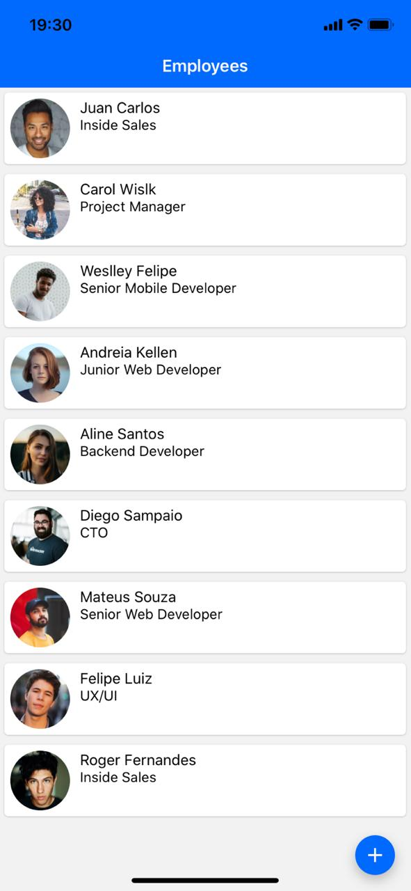
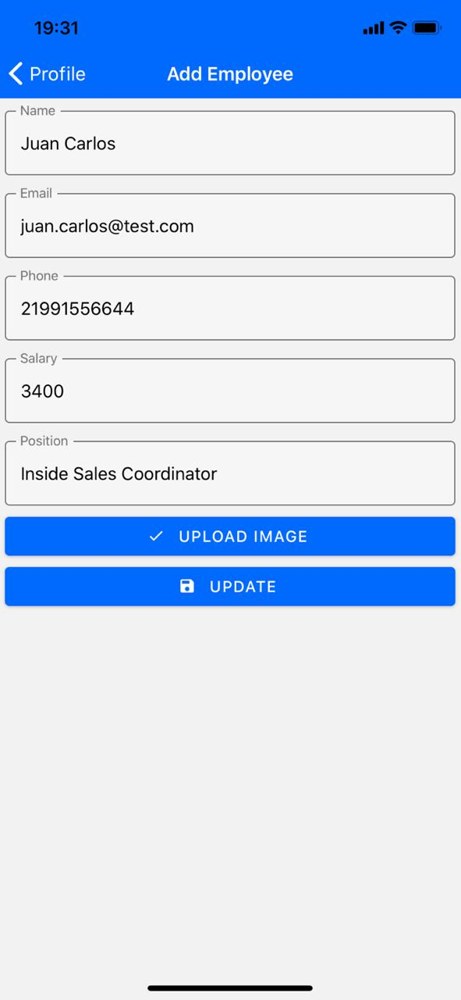
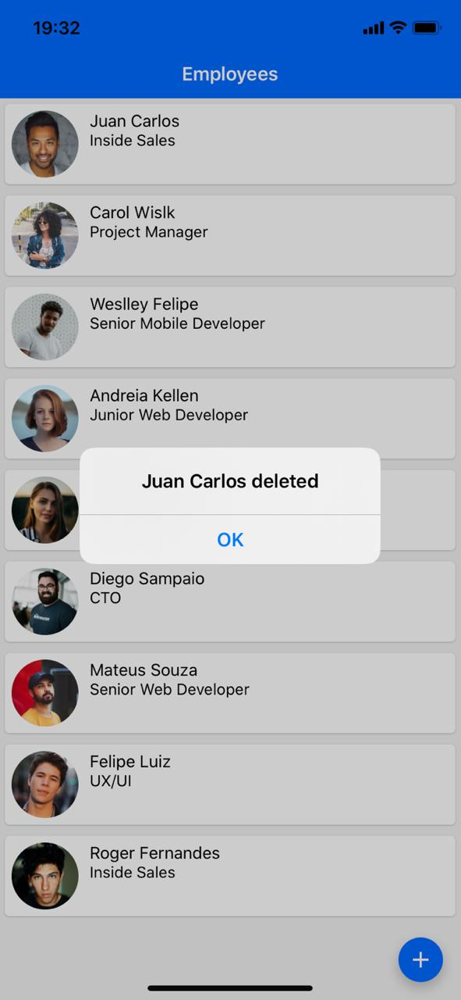
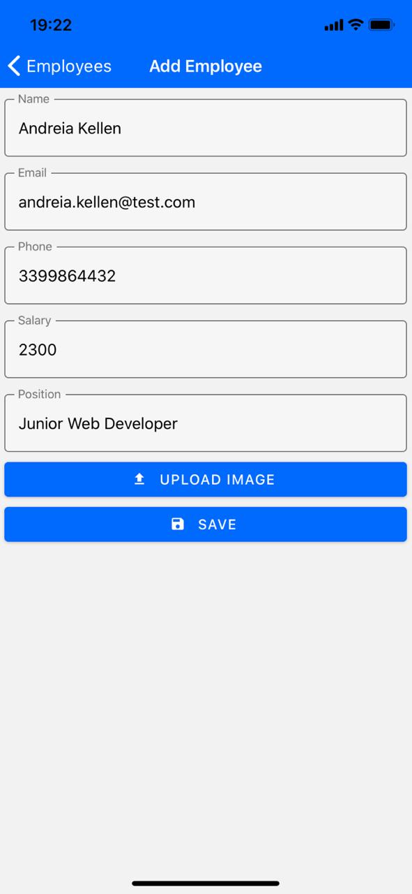
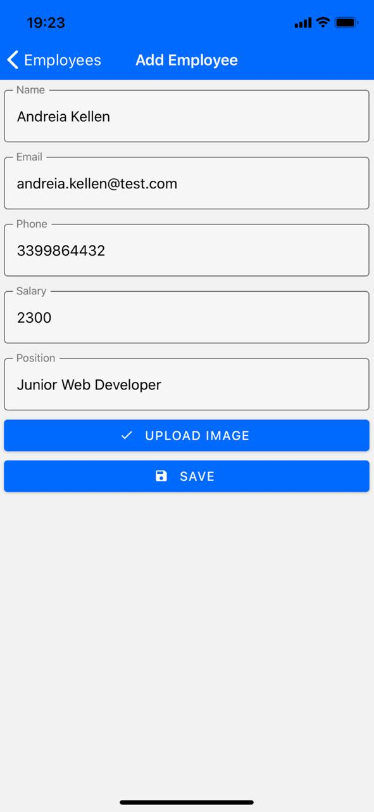

# Employee-App
React Native - iOS and Android App

Course: React Native and Redux Course using hooks (Udemy)
Professor: Mukesh phulwani

# App screens

**Home screen**

**Profile screen**

**Edit screen**

**Delete Employeer**

**Add new employee**

**After Upload image**

